# CRUD App
CRUD App using Reactjs and Nodejs

## Technologies used
Node.js, React.js, Express.js, MySQL

## System prerequisites
 - Node.js 
 - npm
 - MySQL

## Database setup
Run following command in MySQL
```
create database crud_app_db;

use crud_app_db;

create table user (Id int NOT NULL AUTO_INCREMENT PRIMARY KEY, Name varchar(255), Email varchar(255), Password varchar(255), DOB date);

```

## How to run?
1. Aftering completing Database setup, download the repository on your local system.
2. Navigate to `backend` folder from terminal and run `npm install` command.
3. Now, run `npm start` command to start the backend server
4. Navigate to `frontend` folder from a new terminal and run `npm install` command.
5. Now, run `npm run dev` command to start the vite server (frontend).
6. App will run on `http://localhost:5173/`

## Screenshots
List all users
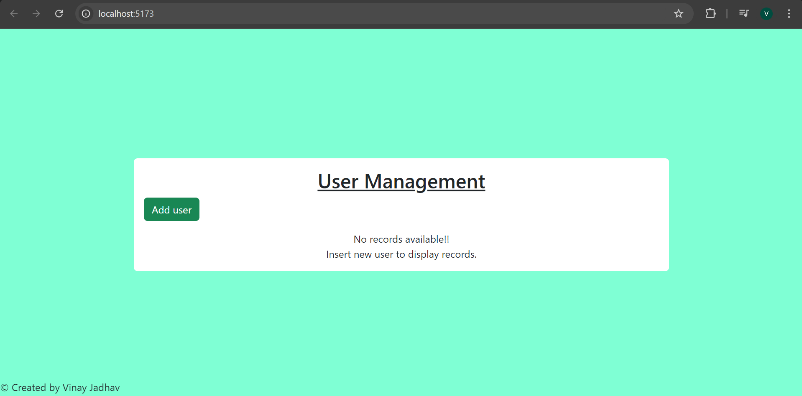

Add user
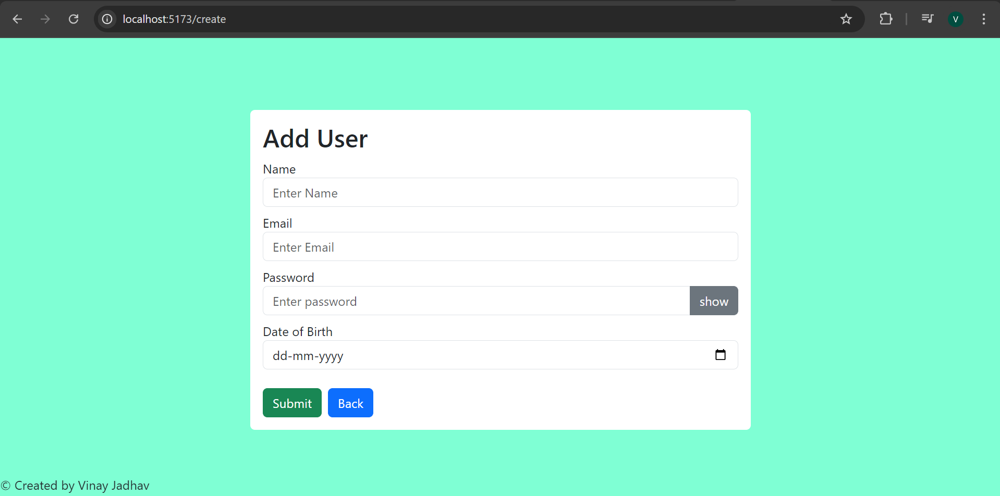

Validations implemented on password field
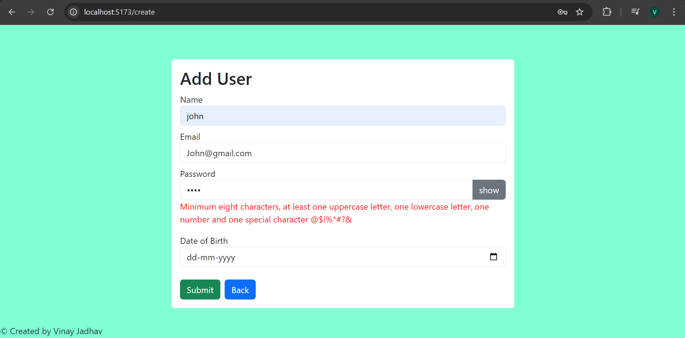

Hide/show password
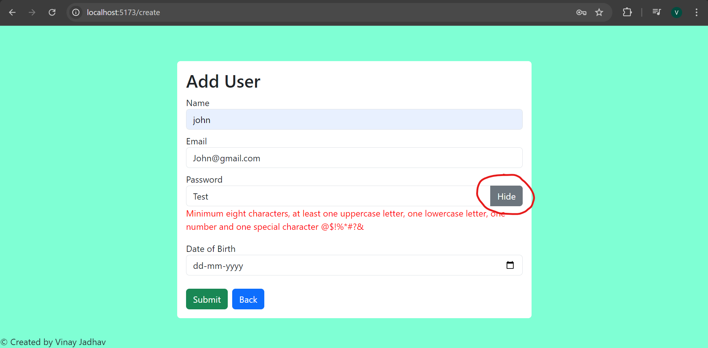

Validation on Date of birth field
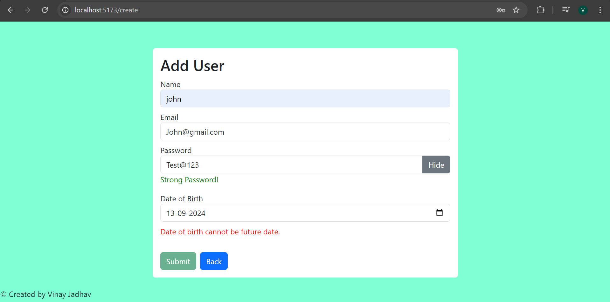

User added
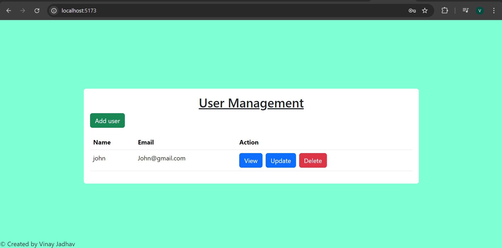

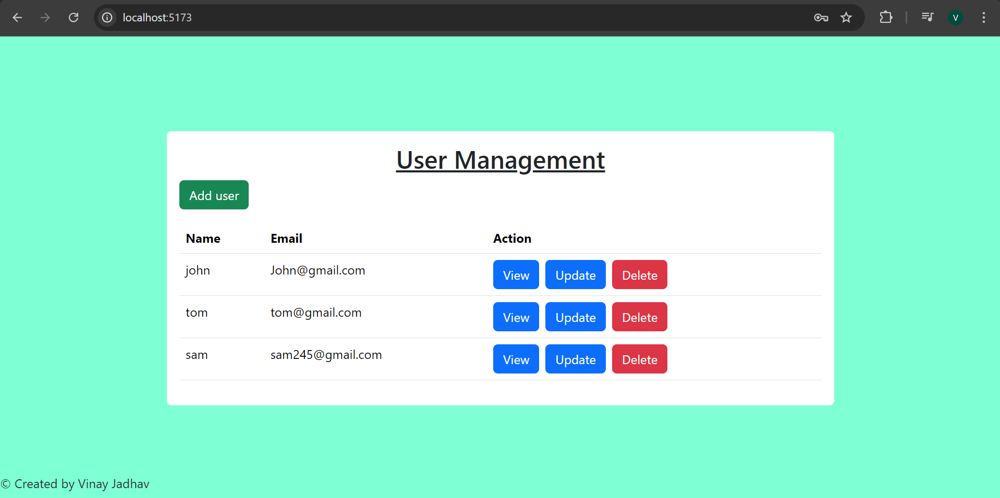

View User Details
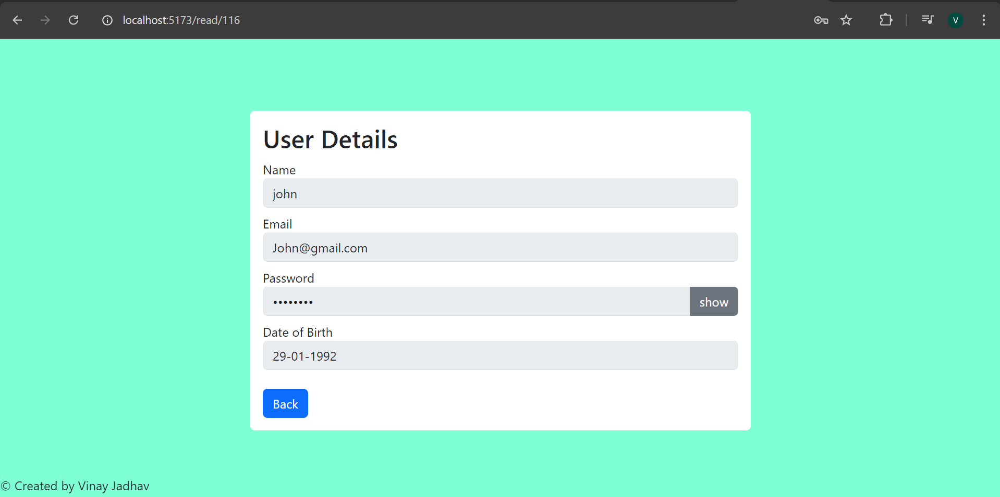

Update User Details
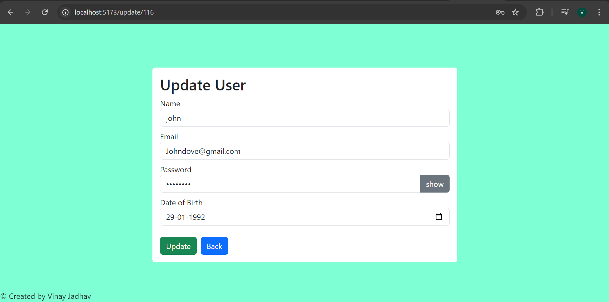

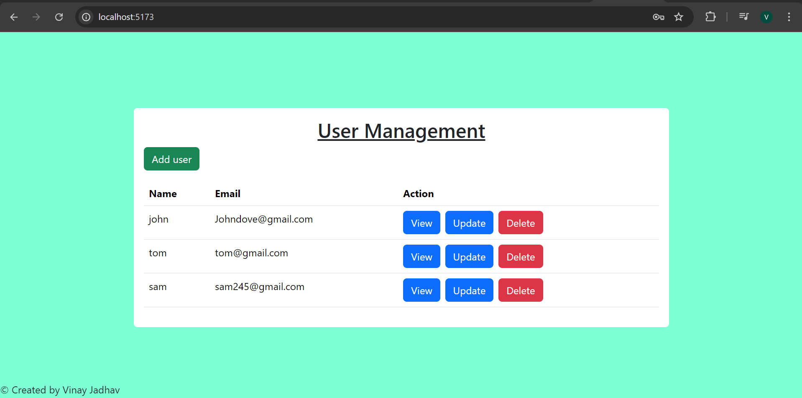

Delete User Details
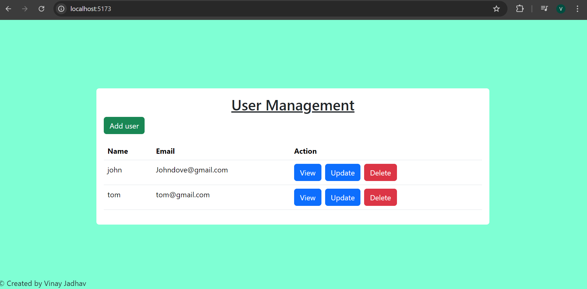

DB Screenshot
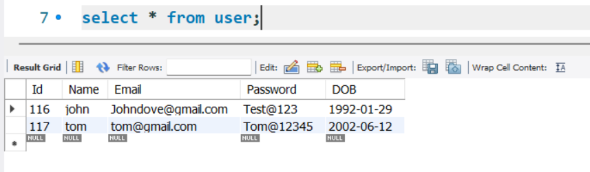
